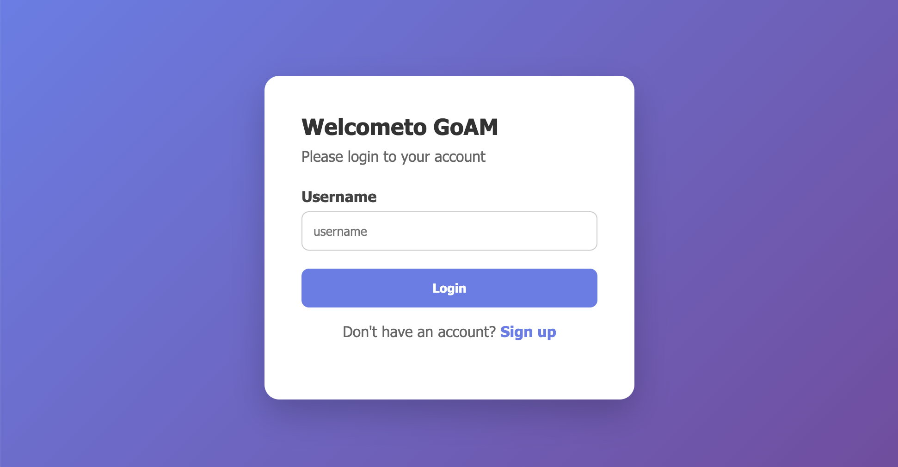
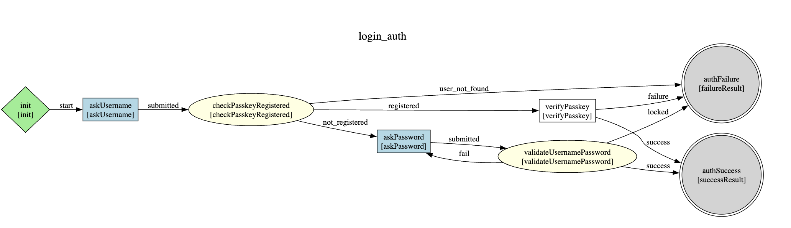

[](https://github.com/Identityplane/GoAM/actions/workflows/ci.yml)

# GoIAM: Flexible and High-Performance Identity Access Management

GoIAM is a modern, high-performance Identity and Access Management system written in Go. It is designed to provide flexibility and scalability for managing authentication and authorization flows. It represents login and registration flows as **graphs**, enabling highly customizable and dynamic user journeys.



---

## ⚠️ Disclaimer

**This project is a work in progress and is not ready for production use.** Expect breaking changes everywhere, incomplete features, and not/limited documentation and code that was not reviewed for security vulnerabilities.

---

## Key Features

- **Graph-Based Flows**: Define login and registration flows as graphs, allowing for complex, multi-step processes.
- **Customizable Nodes**: Each step in the graph is a node, which can be customized to handle specific logic, prompts, or conditions.
- **Performance**: Built with Go and `fasthttp` for maximum performance and low latency. Login journies can be optimized to enable thousands of logins per second.
- **Multitenancy**: Support for multiple tenants with isolated realms per tenant. Each tenant can have multiple realms for different user populations (e.g. customers, staff).
- **Extensibility**: Easily add custom nodes, flows, and integrations to meet your specific requirements.
- **Customization**: Serve static assets like CSS and JavaScript for theming and customization.

---

## Example Login Flow
Below is an example of a **username-password authentication flow** represented as a graph. The graph structure allows endless possibilities - from simple password login to complex flows combining multiple auth methods (OIDC, LDAP, Social, MFA), risk scoring, consent collection, and audit logging. New authentication methods and business logic can be easily added as custom nodes.



This flow includes:
1. **Ask Username**: Prompt the user for their username.
2. **Check if they have a passkey**: Lookup the database if a passkey is registered
3. **Validate Credentials**: Validate the passkeys or check the username and password against the database.
4. **Success/Failure**: Redirect the user based on the validation result.

---

## Getting Started

### Prerequisites

- Go 1.20+
- SQLite (for local development)
- Podman/Docker (for containerized deployment)
- Minikube (for Kubernetes deployment)

### Installation

1. Clone the repository:
   ```bash
   git clone https://github.com/Identityplane/GoAM.git
   cd goiam
   ```

2. Install dependencies:
   ```bash
   go mod tidy
   ```

### Development

The project includes a Makefile with various commands for development and deployment:

#### Local Development
```bash

make all      # Run all checks and build
make test     # Run tests
make build    # Build the binary

# Containerized development with Podman
make podman-build  # Build the container image
make podman-run   # Run the container locally
```

#### Kubernetes Deployment
```bash
# Start Minikube cluster
make k8s-start

# Set up environment for Minikube (run this manually)
eval $(minikube docker-env)

# Build and deploy to Kubernetes
make docker-build  # Build image in K8S cluster
make k8s-deploy   # Apply K8S resources

# Access the service
make k8s-open     # Open service in browser
make k8s-logs     # View logs
make k8s-shell    # Access container shell

# Clean up
make k8s-clean    # Remove all K8S resources
```

### Manual Server Start

Alternatively, you can run the server directly:
```bash
go run ./cmd/main.go
```

---

## Database Setup

For local development, GoIAM uses SQLite. To set up the database:

1. Apply the initial migration:
   ```bash
   sqlite3 cmd/goiam.db < internal/db/sqlite/migrations/001_create_users.sql
   ```

2. Verify the database is set up correctly:
   ```bash
   sqlite3 cmd/goiam.db
   ```

---

## Running Tests

GoIAM includes both unit and integration tests to ensure reliability.

1. Run unit tests:
   ```bash
   go test ./test/unit
   ```

2. Run integration tests:
   ```bash
   go test ./test/integration
   ```

---

## Project Structure

- **`/cmd`**: Entry point for the application.
- **`/internal/auth/graph`**: Core logic for graph-based flows.
- **`/internal/web`**: Web server and handlers.
- **`/config`**: Configuration files for flows and templates.
- **`/test`**: Unit and integration tests.

---

## Example Flow Configuration

Flows are defined in YAML files under the `config/flows` directory. Below is an example of a username-password authentication flow:

```yaml
name: username_password_auth
route: /loginUsernamePw
start: init
nodes:
  init:
    use: init
    next:
      start: askUsername

  askUsername:
    use: askUsername
    next:
      submitted: askPassword
    custom_config:
      message: Please login to your account
      showRegisterLink: true

  askPassword:
    use: askPassword
    next:
      submitted: validateUsernamePassword
    custom_config:
      message: Please login to your account

  validateUsernamePassword:
    use: validateUsernamePassword
    next:
      success: authSuccess
      fail: askPassword
      locked: authFailure

  authSuccess:
    use: successResult
    custom_config:
      message: Login successful!

  authFailure:
    use: failureResult
    custom_config:
      message: Invalid credentials or account locked.
```

---

## Contact

For questions or support, please reach out to [gian-luca.frei@zuehlke.com](mailto:[gian-luca.frei@zuehlke.com).
