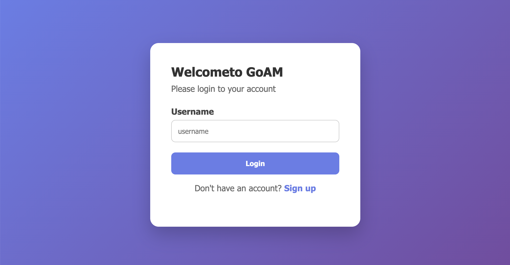
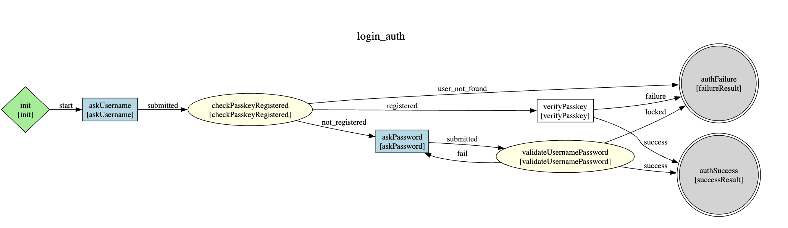
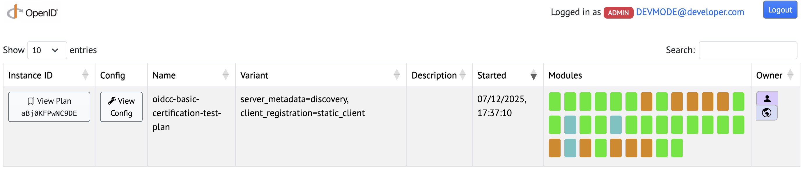

[](https://github.com/Identityplane/GoAM/actions/workflows/ci.yml)
[](https://github.com/Identityplane/GoAM/actions/workflows/cd.yml)

# GoAM: Flexible and High-Performance Identity Access Management

GoAM is a modern, high-performance Identity and Access Management system written in Go. It is designed to provide flexibility and scalability for managing authentication and authorization flows. It represents login and registration flows as **graphs**, enabling highly customizable and dynamic user journeys.



---

**OAuth2 / OIDC Support:**
GoAM is compliant with the OIDC basic-certification-test-plan. The following features are supported:
- AuthCode Flow
- AuthCode with PKCE Flow
- Access Token
- Refresh Token
- Client Authentication (client_secret_basic, client_secret_post)
- Userinfo Endpoint (post-header, post-body)
- Scopes with email, profile, others can be implemented
- OIDC Prompt (login, none)
- OIDC max-age
- OIDC acr_values

We are implementing **OAuth2.1** which comes with the following changes to OAuth2.
- Redirect URIs exact string matching
- One-time-use refresh tokens


## Key Features

- **Graph-Based Flows**: Define login and registration flows as graphs, allowing for complex, multi-step processes.
- **Customizable Nodes**: Each step in the graph is a node, which can be customized to handle specific logic, prompts, or conditions.
- **Performance**: Built with Go and `fasthttp` for maximum performance and low latency. Login journeys can be optimized to enable thousands of logins per second.
- **Multitenancy**: Support for multiple tenants with isolated realms per tenant. Each tenant can have multiple realms for different user populations (e.g. customers, staff).
- **Extensibility**: Easily add custom nodes, flows, and integrations to meet your specific requirements.
- **Customization**: Serve static assets like CSS and JavaScript for theming and customization.


Supported Login Features:
- Captcha
- Remember this device
- Email
- GitHub Login
- OIDC Federated Login
- Multiple Login Options on 1 page
- WebAuthN (Passkeys)
- Password
- Login with Telegram
- TOTP
- Username
- Yubikey OTP
- Email OTP

GoAM is designed to be extended so you can implement your own login steps as simple nodes in the login graph.

---

## Example Login Flow
Below is an example of a **username-password authentication flow** represented as a graph. The graph structure allows endless possibilities - from simple password login to complex flows combining multiple auth methods (OIDC, LDAP, Social, MFA), risk scoring, consent collection, and audit logging. New authentication methods and business logic can be easily added as custom nodes.



This flow includes:
1. **Ask Username**: Prompt the user for their username.
2. **Check if they have a passkey**: Lookup the database if a passkey is registered
3. **Validate Credentials**: Validate the passkeys or check the username and password against the database.
4. **Success/Failure**: Redirect the user based on the validation result.

---

## Getting Started

### Prerequisites

- Go 1.24+ (see `go.mod` for the exact version)
- SQLite (default for local development; no extra install needed on most systems)
- Docker (for container images)
- kubectl and Helm (for Kubernetes deployment)

The `docker` Makefile targets switch to the `orbstack` Docker context first. That is convenient on macOS with [OrbStack](https://orbstack.dev/). On other setups, skip those targets and run the equivalent `docker build` / `docker run` commands yourself.

### Installation

1. Clone the repository:
   ```bash
   git clone https://github.com/Identityplane/GoAM.git
   cd GoAM
   ```

2. Install dependencies:
   ```bash
   go mod tidy
   ```

### Development

The `makefile` defines the following targets for development and 
deployment.

#### Local Development
```bash
make vet       # go vet ./...
make sec       # gosec (excludes the test directory)
make test      # Run tests. (Short tests: go test -short)
make test-all  # full test suite, including longer tests
make swagger   # regenerate Swagger docs (requires swag: go install github.com/swaggo/swag/cmd/swag@latest)
make build     # build the binary to bin/goam
```

`make all` is intended to run swagger, vet, sec, tests, and build. The `staticcheck` step listed in that target is currently commented out in the makefile.

Run the server without building a binary:
```bash
go run ./cmd/main.go
```

By default the HTTP listener is `:8080`. Check `http://localhost:8080/readyz`.

#### Auth UI

The login UI is a separate Next.js app in `auth-ui/`. In development, GoAM reverse-proxies it at `/{tenant}/{realm}/authui/…`.

```bash
cd auth-ui
pnpm install
pnpm run dev
```

Then open `http://localhost:8080/acme/customers/authui/login?debug` (with the GoAM server running).

#### Container images
```bash
make docker         # build goam:latest
make docker-authui  # build goam-authui:latest
make docker-all     # build both images
make docker-run     # run goam:latest on port 8080
```

Equivalent commands without the OrbStack context switch:
```bash
docker build -t goam:latest .
docker build -t goam-authui:latest ./auth-ui
docker run --rm -p 8080:8080 --name goam-dev goam:latest
```

#### Kubernetes (Helm)
```bash
make docker-all    # build GoAM and Auth UI images
make helm-deploy   # helm upgrade --install, then restart and wait for the deployments
```

This expects a working kubectl context and Helm. The chart lives at `helm/goam`.

---

## Database Setup

For local development, GoAM uses SQLite. To set up the database:

1. Apply the initial migration:
   ```bash
   sqlite3 cmd/goiam.db < internal/db/sqlite/migrations/001_create_users.sql
   ```

2. Verify the database is set up correctly:
   ```bash
   sqlite3 cmd/goiam.db
   ```

---

## Running Tests

```bash
make test      # short tests (skips longer cases)
make test-all  # full suite, including integration tests
```

Or call Go directly:
```bash
go test -short -timeout 30000ms ./...
go test -timeout 30000ms ./...
```

---

## Project Structure

- **`/cmd`**: Entry point for the application.
- **`/internal/auth/graph`**: Core logic for graph-based flows.
- **`/internal/web`**: Web server and handlers.
- **`/config`**: Configuration files for flows and templates.
- **`/test`**: Unit and integration tests.

---

## Example Flow Configuration

Flows are defined in YAML files under the `config/flows` directory. Below is an example of a username-password authentication flow:

```yaml
name: username_password_auth
route: /loginUsernamePw
start: init
nodes:
  init:
    use: init
    next:
      start: askUsername

  askUsername:
    use: askUsername
    next:
      submitted: askPassword
    custom_config:
      message: Please login to your account
      showRegisterLink: true

  askPassword:
    use: askPassword
    next:
      submitted: validatePassword
    custom_config:
      message: Please login to your account

  validatePassword:
    use: validatePassword
    next:
      success: authSuccess
      fail: askPassword
      locked: authFailure

  authSuccess:
    use: successResult
    custom_config:
      message: Login successful!

  authFailure:
    use: failureResult
    custom_config:
      message: Invalid credentials or account locked.
```

---

## OIDC Conformance

We are using the OIDC conformance test suite to validate spec conformance. The test logs can be found at: `test/oidc-conformance/logs` 




## Contact

For questions or support, please reach out to [gianluca@identityplane.com](mailto:[gianluca@identityplane.com).
