# GoAM Internal Architecture Guide

This document provides a comprehensive overview of the GoAM (Go Identity and Access Management) system architecture, implementation patterns, and development workflow. It uses the **User Attributes** feature as a concrete example to demonstrate the complete system architecture.

## Table of Contents

1. [System Overview](#system-overview)
2. [Package Dependencies](#package-dependencies)
3. [Architecture Layers](#architecture-layers)
4. [Implementation Workflow](#implementation-workflow)
5. [Database Layer](#database-layer)
6. [Service Layer](#service-layer)
7. [HTTP API Layer](#http-api-layer)
8. [Testing Strategy](#testing-strategy)
9. [System Integration](#system-integration)
10. [Common Patterns](#common-patterns)
11. [Troubleshooting Guide](#troubleshooting-guide)

## System Overview

GoAM is a multi-tenant identity and access management system built with Go. The system follows a layered architecture pattern with clear separation of concerns:

```
┌─────────────────────────────────────────────────────────────┐
│                    HTTP API Layer                           │
│              (Handlers, Middleware, Router)                │
├─────────────────────────────────────────────────────────────┤
│                    Service Layer                           │
│              (Business Logic, Validation)                  │
├─────────────────────────────────────────────────────────────┤
│                   Database Layer                           │
│              (Interfaces, Implementations)                 │
├─────────────────────────────────────────────────────────────┤
│                  Database Storage                          │
│              (PostgreSQL, SQLite)                          │
└─────────────────────────────────────────────────────────────┘
```

## Package Dependencies

The following diagram shows the high-level architecture and dependencies between the core packages in the GoAM system:



### Key Dependency Patterns

1. **Unidirectional Flow**: Dependencies flow from top (HTTP) to bottom (Database)
2. **Interface Contracts**: Services depend on database interfaces, not implementations
3. **Model Sharing**: All layers share the same model definitions
4. **Clean Separation**: Each layer has a single responsibility
5. **Database Abstraction**: Support for both PostgreSQL and SQLite through interfaces

### Package Responsibilities

- **Models**: Core data structures shared across all layers
- **HTTP Layer**: HTTP handling, routing, and API endpoints
- **Service Layer**: Business logic, validation, and orchestration
- **Database Interface**: Contracts and abstractions for database operations
- **Database Implementations**: Concrete PostgreSQL and SQLite adapters

## Architecture Layers

### 1. Model Layer (`pkg/model/`)
**Purpose**: Define data structures and business entities
**Location**: `pkg/model/`
**Example**: `user_attribute.go`

```go
type UserAttribute struct {
    ID        string                 `json:"id" db:"id"`
    UserID    string                 `json:"user_id" db:"user_id"`
    Tenant    string                 `json:"tenant" db:"tenant"`
    Realm     string                 `json:"realm" db:"realm"`
    Type      string                 `json:"type" db:"type"`
    Values    map[string]interface{} `json:"values" db:"values"`
    CreatedAt time.Time             `json:"created_at" db:"created_at"`
    UpdatedAt time.Time             `json:"updated_at" db:"updated_at"`
}
```

**Key Points**:
- Use `db:"field_name"` tags for database field mapping
- Include JSON tags for API serialization
- Define validation methods if needed
- Keep models focused on data representation

### 2. Database Interface Layer (`internal/db/`)
**Purpose**: Define database operation contracts
**Location**: `internal/db/`
**Example**: `userattributedb.go`

```go
type UserAttributeDB interface {
    CreateUserAttribute(ctx context.Context, attribute model.UserAttribute) error
    GetUserAttributeByID(ctx context.Context, tenant, realm, id string) (*model.UserAttribute, error)
    ListUserAttributes(ctx context.Context, tenant, realm, userID string) ([]model.UserAttribute, error)
    UpdateUserAttribute(ctx context.Context, attribute *model.UserAttribute) error
    DeleteUserAttribute(ctx context.Context, tenant, realm, id string) error
}
```

**Key Points**:
- Define interfaces before implementations
- Use context.Context for cancellation/timeout support
- Return concrete types, not interfaces
- Include all CRUD operations needed by the service layer

### 3. Database Implementation Layer
**Purpose**: Provide concrete database implementations
**Location**: `internal/db/{postgres_adapter|sqlite_adapter}/`

#### PostgreSQL Implementation
```go
type PostgresUserAttributeDB struct {
    db *pgxpool.Pool
}

func (p *PostgresUserAttributeDB) CreateUserAttribute(ctx context.Context, attribute model.UserAttribute) error {
    query := `
        INSERT INTO user_attributes (
            id, user_id, tenant, realm, type, values, created_at, updated_at
        ) VALUES ($1, $2, $3, $4, $5, $6, $7, $8)
    `
    
    _, err := p.db.Exec(ctx, query,
        attribute.ID, attribute.UserID, attribute.Tenant, attribute.Realm,
        attribute.Type, attribute.Values, attribute.CreatedAt, attribute.UpdatedAt,
    )
    return err
}
```

**Key Points**:
- Use native PostgreSQL types (JSONB for JSON data)
- Implement proper error handling and logging
- Use parameterized queries to prevent SQL injection
- Return meaningful errors for debugging

#### SQLite Implementation
```go
type SQLiteUserAttributeDB struct {
    db *sqlx.DB
}

func (s *SQLiteUserAttributeDB) CreateUserAttribute(ctx context.Context, attribute model.UserAttribute) error {
    // Convert JSON to string for SQLite
    valuesJSON, _ := json.Marshal(attribute.Values)
    
    query := `
        INSERT INTO user_attributes (
            id, user_id, tenant, realm, type, values, created_at, updated_at
        ) VALUES (?, ?, ?, ?, ?, ?, ?, ?)
    `
    
    _, err := s.db.ExecContext(ctx, query,
        attribute.ID, attribute.UserID, attribute.Tenant, attribute.Realm,
        attribute.Type, string(valuesJSON), attribute.CreatedAt, attribute.UpdatedAt,
    )
    return err
}
```

**Key Points**:
- Convert complex types to strings for SQLite compatibility
- Use `?` placeholders for SQLite queries
- Handle JSON serialization/deserialization manually
- Maintain the same interface contract as PostgreSQL

### 4. Service Layer (`internal/service/`)
**Purpose**: Implement business logic and orchestrate operations
**Location**: `internal/service/`
**Example**: `user_attribute_service.go`

```go
type UserAttributeService interface {
    CreateUserAttribute(ctx context.Context, attribute *model.UserAttribute) (*model.UserAttribute, error)
    GetUserAttributeByID(ctx context.Context, tenant, realm, id string) (*model.UserAttribute, error)
    ListUserAttributes(ctx context.Context, tenant, realm, userID string) ([]model.UserAttribute, error)
    UpdateUserAttribute(ctx context.Context, attribute *model.UserAttribute) error
    DeleteUserAttribute(ctx context.Context, tenant, realm, id string) error
}

type userAttributeServiceImpl struct {
    userAttributeDB db.UserAttributeDB
    userDB          db.UserDB
}
```

**Key Points**:
- Implement business logic and validation
- Coordinate between multiple database operations
- Generate UUIDs and timestamps at service layer
- Validate business rules (e.g., user existence)
- Return meaningful errors for API layer

### 5. HTTP API Layer (`internal/web/`)
**Purpose**: Handle HTTP requests and responses
**Location**: `internal/web/admin_api/`
**Example**: `user_attributes_handler.go`

```go
func HandleCreateUserAttribute(ctx *fasthttp.RequestCtx) {
    tenant := ctx.UserValue("tenant").(string)
    realm := ctx.UserValue("realm").(string)
    userID := ctx.UserValue("id").(string)
    
    var attribute model.UserAttribute
    if err := json.Unmarshal(ctx.PostBody(), &attribute); err != nil {
        ctx.SetStatusCode(http.StatusBadRequest)
        ctx.SetBodyString("Invalid request body: " + err.Error())
        return
    }
    
    // Set path parameters
    attribute.Tenant = tenant
    attribute.Realm = realm
    attribute.UserID = userID
    
    // Call service layer
    createdAttribute, err := service.GetServices().UserAttributeService.CreateUserAttribute(
        context.Background(), &attribute)
    if err != nil {
        ctx.SetStatusCode(http.StatusInternalServerError)
        ctx.SetBodyString("Failed to create attribute: " + err.Error())
        return
    }
    
    // Return response
    jsonData, err := json.MarshalIndent(createdAttribute, "", "  ")
    if err != nil {
        ctx.SetStatusCode(http.StatusInternalServerError)
        ctx.SetBodyString("Failed to marshal response: " + err.Error())
        return
    }
    
    ctx.SetStatusCode(http.StatusCreated)
    ctx.SetContentType("application/json")
    ctx.SetBody(jsonData)
}
```

**Key Points**:
- Extract path parameters from context
- Validate and parse request bodies
- Call appropriate service methods
- Handle errors and return proper HTTP status codes
- Format responses consistently

### 6. Router Configuration (`internal/web/router.go`)
**Purpose**: Define API endpoints and routing
**Location**: `internal/web/router.go`

```go
// User attribute management routes
admin.GET("/{tenant}/{realm}/users/{id}/attributes", adminMiddleware(admin_api.HandleListUserAttributes))
admin.POST("/{tenant}/{realm}/users/{id}/attributes", adminMiddleware(admin_api.HandleCreateUserAttribute))
admin.GET("/{tenant}/{realm}/users/{id}/attributes/{attribute-type}/{attribute-id}", adminMiddleware(admin_api.HandleGetUserAttribute))
admin.PATCH("/{tenant}/{realm}/users/{id}/attributes/{attribute-type}/{attribute-id}", adminMiddleware(admin_api.HandleUpdateUserAttribute))
admin.DELETE("/{tenant}/{realm}/users/{id}/attributes/{attribute-type}/{attribute-id}", adminMiddleware(admin_api.HandleDeleteUserAttribute))
```

**Key Points**:
- Use consistent URL patterns
- Apply appropriate middleware (authentication, authorization)
- Group related endpoints logically
- Use RESTful conventions

## Implementation Workflow

### Step 1: Define the Model
1. Create the data structure in `pkg/model/`
2. Add proper tags (`json:`, `db:`)
3. Include validation methods if needed
4. Write basic tests for JSON serialization

### Step 2: Create Database Interface
1. Define the interface in `internal/db/`
2. Include all CRUD operations needed
3. Use consistent method signatures
4. Document the interface contract

### Step 3: Implement Database Adapters
1. Create PostgreSQL implementation with native types
2. Create SQLite implementation with string conversions
3. Implement proper error handling
4. Add database migrations
5. Write comprehensive tests

### Step 4: Implement Service Layer
1. Create service interface and implementation
2. Add business logic and validation
3. Generate UUIDs and timestamps
4. Coordinate database operations
5. Write unit tests

### Step 5: Create HTTP Handlers
1. Implement all CRUD handlers
2. Handle path parameters and request bodies
3. Call appropriate service methods
4. Return proper HTTP responses
5. Add comprehensive error handling

### Step 6: Configure Routing
1. Add routes to `router.go`
2. Apply appropriate middleware
3. Test endpoint accessibility

### Step 7: Write E2E Tests
1. Create comprehensive test scenarios
2. Test complete user workflows
3. Verify data persistence
4. Test error conditions

### Step 8: System Integration
1. Register services in service registry
2. Initialize database connections
3. Update dependency injection
4. Test complete system

## Database Migrations

### Migration Structure
```
internal/db/postgres_adapter/migrations/
├── 001_create_users.up.sql
├── 002_create_realms.up.sql
├── 010_create_user_attributes.up.sql
└── 010_create_user_attributes.down.sql
```

### Migration Best Practices
1. Use sequential numbering (001, 002, 003...)
2. Include both `.up.sql` and `.down.sql` files
3. Use `IF NOT EXISTS` for table creation
4. Add proper indexes and constraints
5. Include foreign key relationships

### Example Migration
```sql
-- 010_create_user_attributes.up.sql
CREATE TABLE IF NOT EXISTS user_attributes (
    id VARCHAR(36) PRIMARY KEY,
    user_id VARCHAR(36) NOT NULL,
    tenant VARCHAR(255) NOT NULL,
    realm VARCHAR(255) NOT NULL,
    type VARCHAR(255) NOT NULL,
    values JSONB NOT NULL DEFAULT '{}',
    created_at TIMESTAMP NOT NULL DEFAULT NOW(),
    updated_at TIMESTAMP NOT NULL DEFAULT NOW(),
    
    FOREIGN KEY (user_id, tenant, realm) 
        REFERENCES users(id, tenant, realm) 
        ON DELETE CASCADE
);

-- Create indexes for performance
CREATE INDEX IF NOT EXISTS idx_user_attributes_user_id 
    ON user_attributes(user_id);
CREATE INDEX IF NOT EXISTS idx_user_attributes_type 
    ON user_attributes(type);
CREATE INDEX IF NOT EXISTS idx_user_attributes_values 
    ON user_attributes USING GIN(values);
```

## Service Registration

### Service Registry (`internal/service/services.go`)
```go
type Services struct {
    UserService          UserService
    UserAttributeService UserAttributeService
    // ... other services
}

func (s *Services) GetUserAttributeService() UserAttributeService {
    return s.UserAttributeService
}
```

### Service Initialization (`internal/init.go`)
```go
func initServices(databases *Databases) *service.Services {
    userAttributeService := service.NewUserAttributeService(
        databases.UserAttributeDB,
        databases.UserDB,
    )
    
    return &service.Services{
        UserAttributeService: userAttributeService,
        // ... other services
    }
}
```

### Database Initialization
```go
func initDatabase(config *config.Config) (*Databases, error) {
    var databases Databases
    
    if config.Database.Type == "postgres" {
        // Initialize PostgreSQL
        userAttributeDB, err := postgres_adapter.NewUserAttributeDB(postgresDB)
        if err != nil {
            return nil, fmt.Errorf("init user attribute DB: %w", err)
        }
        databases.UserAttributeDB = userAttributeDB
    } else {
        // Initialize SQLite
        userAttributeDB, err := sqlite_adapter.NewUserAttributeDB(sqliteDB)
        if err != nil {
            return nil, fmt.Errorf("init user attribute DB: %w", err)
        }
        databases.UserAttributeDB = userAttributeDB
    }
    
    return &databases, nil
}
```

## Testing Strategy

### 1. Model Tests (`pkg/model/`)
- Test JSON serialization/deserialization
- Verify struct tags are correct
- Test validation methods if any

### 2. Database Tests (`internal/db/`)
- Use parameterized test templates
- Test both PostgreSQL and SQLite implementations
- Verify CRUD operations work correctly
- Test edge cases and error conditions

### 3. Service Tests (`internal/service/`)
- Test business logic and validation
- Mock database dependencies
- Test error handling scenarios

### 4. E2E Tests (`test/integration/`)
- Test complete user workflows
- Verify data persistence across layers
- Test API endpoints end-to-end
- Verify proper error responses

## Common Patterns

### 1. UUID Generation
```go
// Generate UUID at service layer, not database layer
func (s *userAttributeServiceImpl) CreateUserAttribute(ctx context.Context, attribute *model.UserAttribute) (*model.UserAttribute, error) {
    // Generate UUID before database call
    attribute.ID = uuid.NewString()
    attribute.CreatedAt = time.Now()
    attribute.UpdatedAt = time.Now()
    
    // Call database
    err := s.userAttributeDB.CreateUserAttribute(ctx, *attribute)
    if err != nil {
        return nil, err
    }
    
    return attribute, nil
}
```

### 2. Empty Slice Handling
```go
// Return empty slice, not nil, when no results found
func (s *SQLiteUserAttributeDB) ListUserAttributes(ctx context.Context, tenant, realm, userID string) ([]model.UserAttribute, error) {
    // Initialize as empty slice, not nil
    attributes := make([]model.UserAttribute, 0)
    
    // ... database query logic ...
    
    // Always return the slice, even if empty
    return attributes, nil
}
```

### 3. Error Handling
```go
// Use consistent error wrapping
if err != nil {
    return nil, fmt.Errorf("create user attribute: %w", err)
}
```

### 4. Context Usage
```go
// Always pass context.Context through the call chain
func (s *userAttributeServiceImpl) CreateUserAttribute(ctx context.Context, attribute *model.UserAttribute) (*model.UserAttribute, error) {
    // Pass context to database layer
    err := s.userAttributeDB.CreateUserAttribute(ctx, *attribute)
    return attribute, err
}
```

## Troubleshooting Guide

### Common Issues and Solutions

#### 1. "User not found" Errors
**Problem**: Service returns "User not found" when user exists
**Solution**: Check if UserDB instances are properly initialized and connected

#### 2. Empty ID Fields
**Problem**: Created entities have empty ID fields
**Solution**: Generate UUIDs at service layer, not database layer

#### 3. Database Connection Issues
**Problem**: Database operations fail with connection errors
**Solution**: Verify database initialization in `init.go` and service registration

#### 4. Migration Failures
**Problem**: Database migrations fail to run
**Solution**: Check migration file naming and ensure proper sequence

#### 5. Service Not Found
**Problem**: "Service not found" errors in handlers
**Solution**: Verify service registration in `services.go` and initialization in `init.go`

### Debug Checklist
1. ✅ Check if database is properly initialized
2. ✅ Verify service is registered in service registry
3. ✅ Confirm database migrations have run
4. ✅ Check if all dependencies are properly injected
5. ✅ Verify UUID generation is happening at service layer
6. ✅ Ensure empty results return empty slices, not nil

## Conclusion

This architecture provides a robust, scalable foundation for building identity management features in GoAM. By following these patterns and layers, developers can:

- **Maintain Consistency**: All features follow the same architectural patterns
- **Ensure Testability**: Each layer can be tested independently
- **Support Multiple Databases**: PostgreSQL and SQLite implementations share the same interface
- **Scale Efficiently**: Clear separation of concerns allows for easy optimization
- **Debug Effectively**: Well-defined layers make troubleshooting straightforward

The user attributes implementation demonstrates how all these layers work together to provide a complete, production-ready feature. By following this guide, developers can implement new features with confidence, knowing they'll integrate seamlessly with the existing system architecture.
